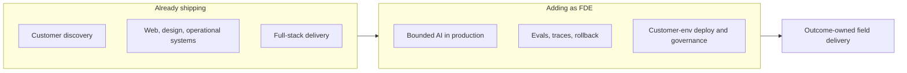
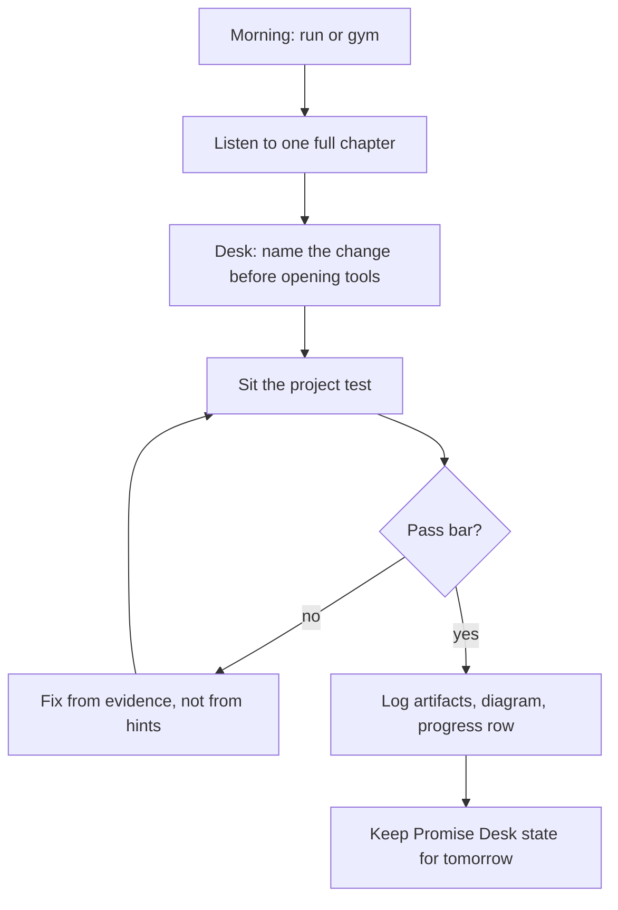
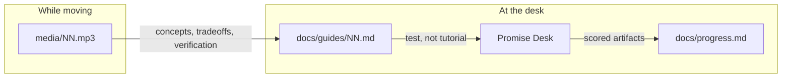
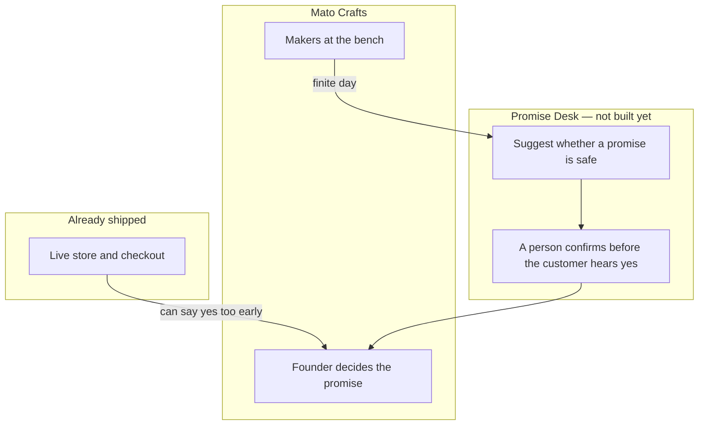
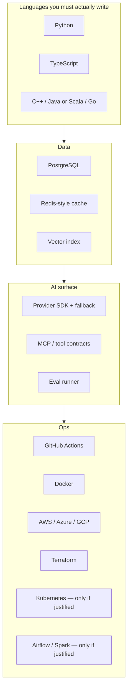

# FullStack in Audio

**Listen on the run. Sit the test at the desk. Ship Promise Desk for Mato Crafts.**

A public, audiobook-first course from software engineer to [Forward Deployed Engineer](https://roadmap.sh/forward-deployed-engineer). Chapter 1 is live. Later chapters are written when asked. No tutorial recipes.

This is [Kushal Shrestha](https://github.com/Kuu44)'s study log, not a product pitch. The daily project is the work. It starts empty on purpose.

| | |
| --- | --- |
| **Learner** | Kushal Shrestha — software engineer, Lalitpur, Nepal |
| **From** | Shipping customer software at [Niyalo](https://niyalo.com) and [Youanai](https://youanai.com) |
| **To** | Forward deployed engineer: outcome-owned delivery inside a customer's environment |
| **Loop** | One full chapter while running or at the gym, then the chapter test at the computer |
| **Build** | [Promise Desk](fieldops/README.md) — keep a handmade studio from promising what the bench cannot make |
| **Source map** | [roadmap.sh/forward-deployed-engineer](https://roadmap.sh/forward-deployed-engineer) |

---

## Framing

I am a software engineer who already ships for real customers. I founded [Niyalo](https://niyalo.com), a product studio: websites, brand systems, and operational software (storefronts, inventory, invoices, dashboards). I co-founded [Youanai](https://youanai.com) and own most of its engineering across schema, API, UI, and workers.

That is a strong base for product engineering. It is not yet the FDE job.

An FDE is accountable for a **measurable customer outcome in someone else's environment** — their identity provider, their cloud, their security review, their tired operators — and for leaving a system that still works after the engineer leaves. Agency work already includes discovery, design, and delivery. The missing stack is the field one: bounded AI behavior, evals, data contracts, deployment evidence, governance, and stakeholder sequencing under someone else's constraints.

This repo is how I fast-track that stack without pretending I am starting from zero, and without skipping the parts I have not had to prove in a customer's production.



---

## Daily operating system

I go running or to the gym every morning. That block is one chapter, start to finish — usually 32 to 40 minutes, never under 30. No 1.5x speed. No skipping the recap.

Then I come back to the computer and sit that chapter's **project test** against Promise Desk. The audio taught the concepts, tradeoffs, failure modes, and how to verify. The guide does not give steps. If I cannot attempt the work from listening, the chapter failed, not me.



Rules that stay locked:

1. **One chapter per session.** Partial listens do not count.
2. **The project is a test.** Goal, constraints, artifacts, rubric. No recipe.
3. **Hints stay inverted** at the bottom of the guide. Audio never reads them.
4. **Practice is not time-boxed.** It ends at demonstrated behavior.
5. **Do not paste a finished solution.** Type it. Decide it. Carry it forward.

---

## How a chapter is built

Every chapter ships as three files with the same number and slug:

| Artifact | Path | Job |
| --- | --- | --- |
| Audio | [`media/NN-slug.mp3`](media) | Taught lesson. ~32–45 minutes. Spoken prose only. |
| Narration script | [`docs/lessons/NN-slug.md`](docs/lessons) | Source of the audio, with a TTS header that is not spoken. |
| Project guide | [`docs/guides/NN-slug.md`](docs/guides) | Exam paper: goal, starting state, constraints, artifacts, pass bar, inverted hints. |

The [project context](docs/project-context.md) is how a chapter is produced: length, guide rules, and how the audio is rendered.



---

## Promise Desk

One system, for one studio. **Mato Crafts** already has a store. The course builds the limit that store was missing: a promise the bench can keep. By the capstone it should have a real interface, a service, a record of who promised a date, a bounded suggestion path, and a handoff the studio can run without you.

Chapter 1 is the charter. When a suggestion exists, a human tells the customer yes or no. Nothing confirms an order on its own.



The diagram above is the chapter 1 boundary, not a finished system. Work for this chapter lands in [`fieldops/01-charter/`](fieldops/01-charter/README.md).

---

## Lesson plan

Only chapter 1 is live.

| # | Listen | Audio | Lesson | Test |
| --- | --- | --- | --- | --- |
| 1 | Entering the FDE field | [mp3](media/01-entering-the-field.mp3) | [script](docs/lessons/01-entering-the-field.md) | [charter for Mato Crafts](docs/guides/01-entering-the-field.md) |

Further chapters are written when you ask for them.

---

## Vendors and tools that show up

The course is vendor-aware and vendor-skeptical. A chapter that names a product also requires a reason to use it, or a written reason not to.



Those tools show up only in a chapter that is actually written. An assistant does not get to own requirements, secrets, or verification.

---

## Repository layout

```text
.
├── README.md
├── docs/
│   ├── lessons/01-entering-the-field.md
│   ├── guides/01-entering-the-field.md
│   ├── progress.md
│   ├── project-context.md
│   └── world-plan.md
├── media/01-entering-the-field.mp3
├── fieldops/01-charter/
```

Chapter 1 audio is already rendered.

---

## How to follow along

1. Play chapter 1 while you move. Do not open the guide first.
2. At the desk, read only the goal, constraints, artifacts, and pass bar.
3. Write the charter. Score it. Log the row in `docs/progress.md`.
4. Stop there until the next chapter is written.

If you fork this: keep the listen-then-test loop. Turning the guides into tutorials defeats the course.

---

## Status

| Piece | State |
| --- | --- |
| Chapter 1 lesson, test, and audio | Live |
| Promise Desk charter | Not written yet |
| Progress | [Empty log](docs/progress.md) |

---

## Attribution

Curriculum sequence follows the public [Forward Deployed Engineer roadmap](https://roadmap.sh/forward-deployed-engineer) and its [source topics](https://github.com/nilbuild/developer-roadmap/tree/master/roadmaps/forward-deployed-engineer/content). Lesson prose, project tests, and audio are original to this repo. Mato Crafts is a real studio. The charter keeps observed facts and assumptions separate.

Questions or corrections: open an issue, or find me at [kuu44](https://github.com/Kuu44) / [linkedin.com/in/kuu44](https://www.linkedin.com/in/kuu44).
