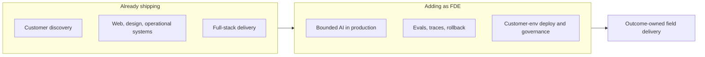
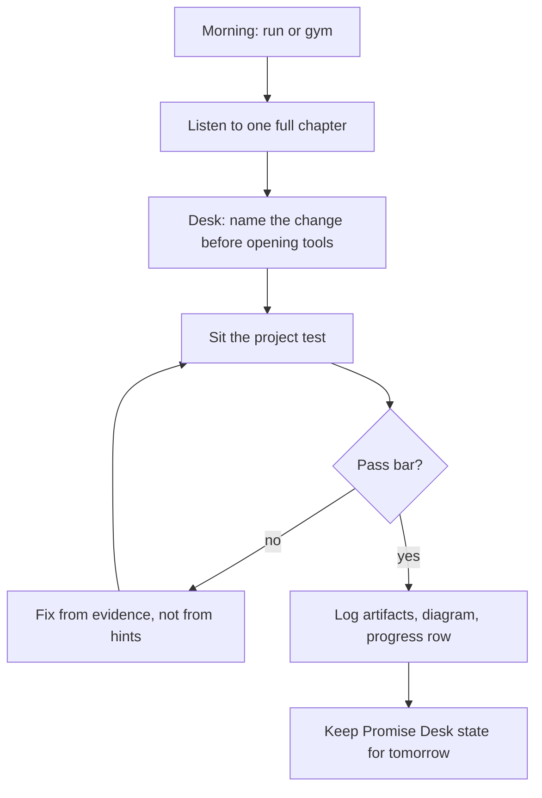
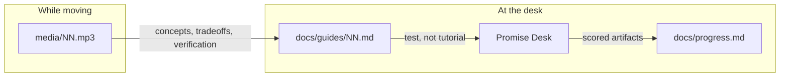
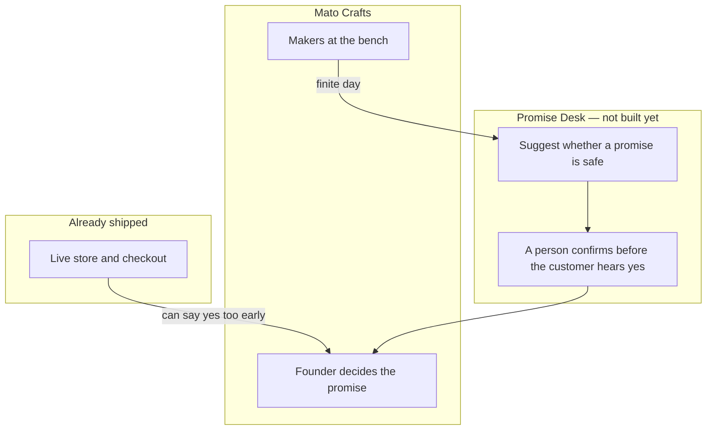
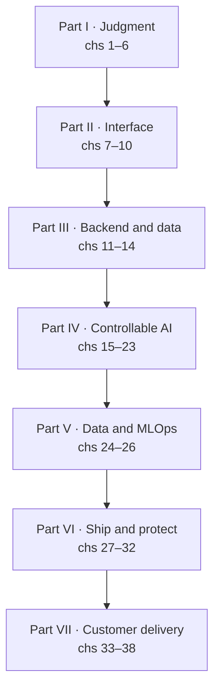
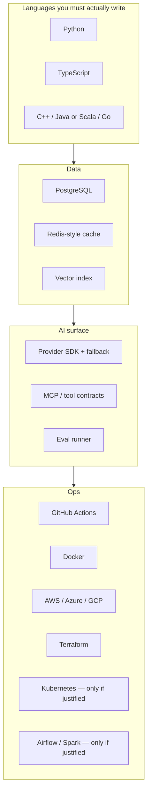

# FullStack in Audio

**Listen on the run. Sit the test at the desk. Ship Promise Desk for Mato Crafts.**

A public, audiobook-first conversion course from software engineer to [Forward Deployed Engineer](https://roadmap.sh/forward-deployed-engineer). Thirty-eight chapters. About twenty-three hours of audio. One accumulating customer system. No tutorial recipes.

This is [Kushal Shrestha](https://github.com/Kuu44)'s study log, not a product pitch. The curriculum is complete and listen-ready. The daily projects are the work; they start empty on purpose.

| | |
| --- | --- |
| **Learner** | Kushal Shrestha — software engineer, Lalitpur, Nepal |
| **From** | Shipping customer software at [Niyalo](https://niyalo.com) and [Youanai](https://youanai.com) |
| **To** | Forward deployed engineer: outcome-owned delivery inside a customer's environment |
| **Loop** | One full chapter while running or at the gym, then the chapter test at the computer |
| **Build** | [Promise Desk](fieldops/README.md) — keep a handmade studio from promising what the bench cannot make |
| **Source map** | [roadmap.sh/forward-deployed-engineer](https://roadmap.sh/forward-deployed-engineer) |

---

## Framing

I am a software engineer who already ships for real customers. I founded [Niyalo](https://niyalo.com), a product studio: websites, brand systems, and operational software (storefronts, inventory, invoices, dashboards). I co-founded [Youanai](https://youanai.com) and own most of its engineering across schema, API, UI, and workers.

That is a strong base for product engineering. It is not yet the FDE job.

An FDE is accountable for a **measurable customer outcome in someone else's environment** — their identity provider, their cloud, their security review, their tired operators — and for leaving a system that still works after the engineer leaves. Agency work already includes discovery, design, and delivery. The missing stack is the field one: bounded AI behavior, evals, data contracts, deployment evidence, governance, and stakeholder sequencing under someone else's constraints.

This repo is how I fast-track that stack without pretending I am starting from zero, and without skipping the parts I have not had to prove in a customer's production.



---

## Daily operating system

I go running or to the gym every morning. That block is one chapter, start to finish — usually 32 to 40 minutes, never under 30. No 1.5x speed. No skipping the recap.

Then I come back to the computer and sit that chapter's **project test** against Promise Desk. The audio taught the concepts, tradeoffs, failure modes, and how to verify. The guide does not give steps. If I cannot attempt the work from listening, the chapter failed, not me.



Rules that stay locked:

1. **One chapter per session.** Partial listens do not count.
2. **The project is a test.** Goal, constraints, artifacts, rubric. No recipe.
3. **Hints stay inverted** at the bottom of the guide. Audio never reads them.
4. **Practice is not time-boxed.** It ends at demonstrated behavior.
5. **Do not paste a finished solution.** Type it. Decide it. Carry it forward.

---

## How a chapter is built

Every chapter ships as three files with the same number and slug:

| Artifact | Path | Job |
| --- | --- | --- |
| Audio | [`media/NN-slug.mp3`](media) | Taught lesson. ~32–45 minutes. Spoken prose only. |
| Narration script | [`docs/lessons/NN-slug.md`](docs/lessons) | Source of the audio, with a TTS header that is not spoken. |
| Project guide | [`docs/guides/NN-slug.md`](docs/guides) | Exam paper: goal, starting state, constraints, artifacts, pass bar, inverted hints. |

The [chapter list](docs/chapter-list.md) is the curriculum contract. The [project context](docs/project-context.md) is the production spec (length policy, guide rules, rendering contract).



---

## Promise Desk

One system, for one studio. **Mato Crafts** already has a store. The course builds the limit that store was missing: a promise the bench can keep. By the capstone it should have a real interface, a service, a record of who promised a date, a bounded suggestion path, and a handoff the studio can run without you.

Chapter 1 is the charter. The AI, when it exists, suggests. A human tells the customer yes or no. Nothing confirms an order on its own.

Chapters 2–38 in the lesson table below are still the previous draft (a fictional logistics company). Their audio is unchanged. Do not do those projects until they are rewritten. See [the world plan](docs/world-plan.md). The old chapter 1 audio is in [archive/harborline](archive/harborline/).



The diagram above is the chapter 1 boundary, not the finished system. The later technical layers in the old draft — API, database, evals, deploy — get rebuilt onto this studio when those chapters are rewritten. Work for chapter 1 lands in [`fieldops/01-charter/`](fieldops/01-charter/README.md).

---

## Lesson plan

38 chapters. Chapter 1 is the Mato Crafts rewrite and is the one to listen to. The rest of this table is the previous draft, kept so the map of topics does not disappear while it is retargeted. Full coverage notes for the live FDE map are in [the chapter list](docs/chapter-list.md).



### Part I — Enter the field and establish engineering judgment

| # | Listen | Audio | Lesson | Test |
| --- | --- | --- | --- | --- |
| 1 | Entering the FDE field | [mp3](media/01-entering-the-field.mp3) | [script](docs/lessons/01-entering-the-field.md) | [charter, RACI, risks](docs/guides/01-entering-the-field.md) |
| 2 | CS and runtime choices | [mp3](media/02-computer-science-and-runtime-choices.mp3) | [script](docs/lessons/02-computer-science-and-runtime-choices.md) | [priority rule in three runtimes](docs/guides/02-computer-science-and-runtime-choices.md) |
| 3 | Linux, shell, Python | [mp3](media/03-linux-shell-and-python.mp3) | [script](docs/lessons/03-linux-shell-and-python.md) | [local intake CLI](docs/guides/03-linux-shell-and-python.md) |
| 4 | Git and the full-stack seam | [mp3](media/04-versioned-delivery-and-the-full-stack-seam.mp3) | [script](docs/lessons/04-versioned-delivery-and-the-full-stack-seam.md) | [reviewable repo + seam diagram](docs/guides/04-versioned-delivery-and-the-full-stack-seam.md) |
| 5 | DSA and system design | [mp3](media/05-data-structures-and-system-design.mp3) | [script](docs/lessons/05-data-structures-and-system-design.md) | [intake-to-triage design](docs/guides/05-data-structures-and-system-design.md) |
| 6 | Software architecture | [mp3](media/06-software-architecture.mp3) | [script](docs/lessons/06-software-architecture.md) | [core / config / adapter split](docs/guides/06-software-architecture.md) |

### Part II — Build the customer-facing experience

| # | Listen | Audio | Lesson | Test |
| --- | --- | --- | --- | --- |
| 7 | HTML and accessible intake | [mp3](media/07-frontend-foundations.mp3) | [script](docs/lessons/07-frontend-foundations.md) | [keyboard-first intake page](docs/guides/07-frontend-foundations.md) |
| 8 | CSS for operational UI | [mp3](media/08-css-operational-interfaces.mp3) | [script](docs/lessons/08-css-operational-interfaces.md) | [severity readable without color](docs/guides/08-css-operational-interfaces.md) |
| 9 | JavaScript / TypeScript | [mp3](media/09-javascript-typescript.mp3) | [script](docs/lessons/09-javascript-typescript.md) | [typed async submit path](docs/guides/09-javascript-typescript.md) |
| 10 | React application structure | [mp3](media/10-react-frontend-apps.mp3) | [script](docs/lessons/10-react-frontend-apps.md) | [list + detail operator workspace](docs/guides/10-react-frontend-apps.md) |

### Part III — Make the backend and data reliable

| # | Listen | Audio | Lesson | Test |
| --- | --- | --- | --- | --- |
| 11 | Backend and Node.js | [mp3](media/11-backend-services-nodejs.mp3) | [script](docs/lessons/11-backend-services-nodejs.md) | [authoritative FieldOps API](docs/guides/11-backend-services-nodejs.md) |
| 12 | API design, identity, GraphQL | [mp3](media/12-api-design-and-security.mp3) | [script](docs/lessons/12-api-design-and-security.md) | [RBAC + published contract](docs/guides/12-api-design-and-security.md) |
| 13 | SQL and PostgreSQL | [mp3](media/13-sql-and-postgresql.mp3) | [script](docs/lessons/13-sql-and-postgresql.md) | [durable incidents and audit](docs/guides/13-sql-and-postgresql.md) |
| 14 | NoSQL and storage fit | [mp3](media/14-nosql-and-storage-fit.mp3) | [script](docs/lessons/14-nosql-and-storage-fit.md) | [expiring cache, not a second truth](docs/guides/14-nosql-and-storage-fit.md) |

### Part IV — Build AI behavior that can be controlled

| # | Listen | Audio | Lesson | Test |
| --- | --- | --- | --- | --- |
| 15 | LLM fundamentals and providers | [mp3](media/15-ai-engineering-and-provider-selection.mp3) | [script](docs/lessons/15-ai-engineering-and-provider-selection.md) | [replaceable suggestion seam](docs/guides/15-ai-engineering-and-provider-selection.md) |
| 16 | Prompt engineering and versioning | [mp3](media/16-prompt-engineering-and-versioning.mp3) | [script](docs/lessons/16-prompt-engineering-and-versioning.md) | [versioned instruction + fixtures](docs/guides/16-prompt-engineering-and-versioning.md) |
| 17 | Cursor, Claude Code, Codex, Gemini | [mp3](media/17-ai-assisted-development.mp3) | [script](docs/lessons/17-ai-assisted-development.md) | [engineer-owned assist protocol](docs/guides/17-ai-assisted-development.md) |
| 18 | Tools, functions, MCP | [mp3](media/18-tools-functions-and-mcp.mp3) | [script](docs/lessons/18-tools-functions-and-mcp.md) | [read-only lookup, no write path](docs/guides/18-tools-functions-and-mcp.md) |
| 19 | Agents and architectures | [mp3](media/19-ai-agents-and-architectures.mp3) | [script](docs/lessons/19-ai-agents-and-architectures.md) | [bounded state machine + approval](docs/guides/19-ai-agents-and-architectures.md) |
| 20 | Memory, RAG, vector DBs | [mp3](media/20-memory-rag-and-vector-databases.mp3) | [script](docs/lessons/20-memory-rag-and-vector-databases.md) | [cited runbooks or decline](docs/guides/20-memory-rag-and-vector-databases.md) |
| 21 | Multi-agent limits | [mp3](media/21-multi-agent-design-and-limits.mp3) | [script](docs/lessons/21-multi-agent-design-and-limits.md) | [disagreement reaches a human](docs/guides/21-multi-agent-design-and-limits.md) |
| 22 | Evals and regression | [mp3](media/22-evaluation-pipelines-and-regression-testing.mp3) | [script](docs/lessons/22-evaluation-pipelines-and-regression-testing.md) | [gate that catches a planted regression](docs/guides/22-evaluation-pipelines-and-regression-testing.md) |
| 23 | Latency and cost | [mp3](media/23-latency-and-cost-optimization.mp3) | [script](docs/lessons/23-latency-and-cost-optimization.md) | [budget with a useful fallback](docs/guides/23-latency-and-cost-optimization.md) |

### Part V — Move and operate the data and model workflows

| # | Listen | Audio | Lesson | Test |
| --- | --- | --- | --- | --- |
| 24 | Data engineering and pipelines | [mp3](media/24-data-engineering-and-data-pipelines.mp3) | [script](docs/lessons/24-data-engineering-and-data-pipelines.md) | [idempotent asset ingest](docs/guides/24-data-engineering-and-data-pipelines.md) |
| 25 | Airflow and Spark | [mp3](media/25-orchestration-with-airflow-and-spark.mp3) | [script](docs/lessons/25-orchestration-with-airflow-and-spark.md) | [scheduled refresh, justified scale](docs/guides/25-orchestration-with-airflow-and-spark.md) |
| 26 | MLOps and managed ML | [mp3](media/26-mlops-and-model-deployment.mp3) | [script](docs/lessons/26-mlops-and-model-deployment.md) | [immutable AI release + rollback](docs/guides/26-mlops-and-model-deployment.md) |

### Part VI — Ship and protect the production-shaped system

| # | Listen | Audio | Lesson | Test |
| --- | --- | --- | --- | --- |
| 27 | DevOps, CI/CD, Actions | [mp3](media/27-devops-cicd-and-github-actions.mp3) | [script](docs/lessons/27-devops-cicd-and-github-actions.md) | [unsafe change cannot promote](docs/guides/27-devops-cicd-and-github-actions.md) |
| 28 | Docker and containers | [mp3](media/28-docker-and-containers.mp3) | [script](docs/lessons/28-docker-and-containers.md) | [non-root images, visible health](docs/guides/28-docker-and-containers.md) |
| 29 | AWS, Azure, GCP | [mp3](media/29-cloud-platforms-and-provider-selection.mp3) | [script](docs/lessons/29-cloud-platforms-and-provider-selection.md) | [constraint-driven landing zone](docs/guides/29-cloud-platforms-and-provider-selection.md) |
| 30 | Terraform and Kubernetes | [mp3](media/30-infrastructure-as-code-and-kubernetes.mp3) | [script](docs/lessons/30-infrastructure-as-code-and-kubernetes.md) | [recreate from reviewed defs](docs/guides/30-infrastructure-as-code-and-kubernetes.md) |
| 31 | Observability | [mp3](media/31-observability-for-apps-and-ai.mp3) | [script](docs/lessons/31-observability-for-apps-and-ai.md) | [one incident, one correlation ID](docs/guides/31-observability-for-apps-and-ai.md) |
| 32 | Security, privacy, AI governance | [mp3](media/32-security-privacy-and-ai-governance.mp3) | [script](docs/lessons/32-security-privacy-and-ai-governance.md) | [risk-control pack + abuse tests](docs/guides/32-security-privacy-and-ai-governance.md) |

### Part VII — Deliver value in the customer environment

| # | Listen | Audio | Lesson | Test |
| --- | --- | --- | --- | --- |
| 33 | Discovery and requirements | [mp3](media/33-discovery-and-scoping.mp3) | [script](docs/lessons/33-discovery-and-scoping.md) | [four-stakeholder discovery](docs/guides/33-discovery-and-scoping.md) |
| 34 | Scoping, sequencing, tradeoffs | [mp3](media/34-scoping-and-sequencing.mp3) | [script](docs/lessons/34-scoping-and-sequencing.md) | [evidence before the full system](docs/guides/34-scoping-and-sequencing.md) |
| 35 | Business acumen and AI ROI | [mp3](media/35-business-acumen-and-roi.mp3) | [script](docs/lessons/35-business-acumen-and-roi.md) | [labelled cost/benefit, no fake certainty](docs/guides/35-business-acumen-and-roi.md) |
| 36 | Stakeholders and feedback | [mp3](media/36-stakeholders-and-feedback.mp3) | [script](docs/lessons/36-stakeholders-and-feedback.md) | [visible decisions, including nos](docs/guides/36-stakeholders-and-feedback.md) |
| 37 | Communication and writing | [mp3](media/37-communication-and-writing.mp3) | [script](docs/lessons/37-communication-and-writing.md) | [tested operator + engineer handoff](docs/guides/37-communication-and-writing.md) |
| 38 | Capstone | [mp3](media/38-capstone-handoff.mp3) | [script](docs/lessons/38-capstone-handoff.md) | [end-to-end pilot candidate](docs/guides/38-capstone-handoff.md) |

The long-form outline — roadmap nodes, tools, pass bars — is in [`docs/chapter-list.md`](docs/chapter-list.md). Progress against the pass bars is in [`docs/progress.md`](docs/progress.md).

---

## Vendors and tools that show up

The course is vendor-aware and vendor-skeptical. A chapter that names a product also requires a reason to use it, or a written reason not to.



Assistants named in chapter 17 (Cursor, Claude Code, Codex, Gemini) are in scope as tools. They do not get to own requirements, secrets, or verification.

---

## Repository layout

```text
.
├── README.md                 ← you are here
├── LICENSE
├── docs/
│   ├── chapter-list.md       ← curriculum contract
│   ├── project-context.md    ← length, guide, and render rules
│   ├── progress.md           ← scored log
│   ├── lessons/              ← 38 narration scripts
│   └── guides/               ← 38 project tests
├── media/                    ← 38 rendered mp3s (~12 MB each)
└── fieldops/                 ← the accumulating system
```

Audio is already rendered (`en-US-AndrewNeural` via `edge-tts`, about 146 words per minute). Re-rendering is not required to take the course.

---

## How to follow along

1. Clone the repo. The mp3s are ordinary Git blobs, about 460 MB.
2. Play chapter 1 while you move. Do not open the guide first.
3. At the desk, read only the goal, constraints, artifacts, and pass bar.
4. Produce the artifacts. Score yourself. Log the row.
5. Tomorrow, start from whatever you actually built.

If you fork this: keep the listen-then-test loop. Turning the guides into tutorials defeats the course.

---

## Status

| Piece | State |
| --- | --- |
| 38 lessons | Ready |
| 38 project tests | Ready |
| 38 audio files | Rendered and listen-ready |
| Promise Desk | Chapter 1 charter not written yet. Later layers wait on the rewrite. |
| Daily progress | [Empty log](docs/progress.md) |

---

## Attribution

Curriculum sequence follows the public [Forward Deployed Engineer roadmap](https://roadmap.sh/forward-deployed-engineer) and its [source topics](https://github.com/nilbuild/developer-roadmap/tree/master/roadmaps/forward-deployed-engineer/content). Lesson prose, project tests, and audio are original to this repo. Mato Crafts is a real studio; the charter must keep observed facts and assumptions separate. The earlier Harborline Logistics draft of chapter 1 is archived.

Questions or corrections: open an issue, or find me at [kuu44](https://github.com/Kuu44) / [linkedin.com/in/kuu44](https://www.linkedin.com/in/kuu44).
